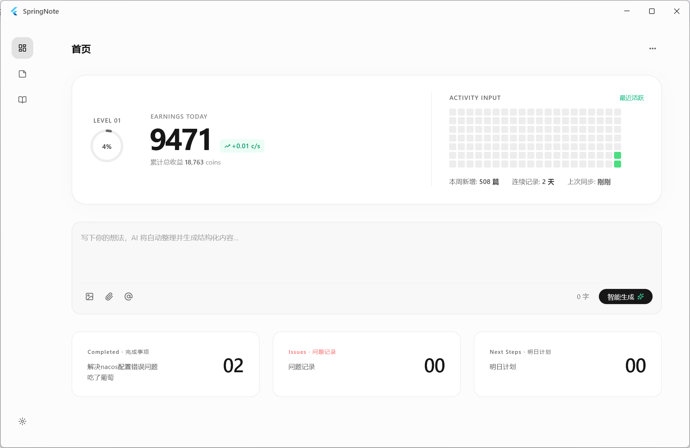
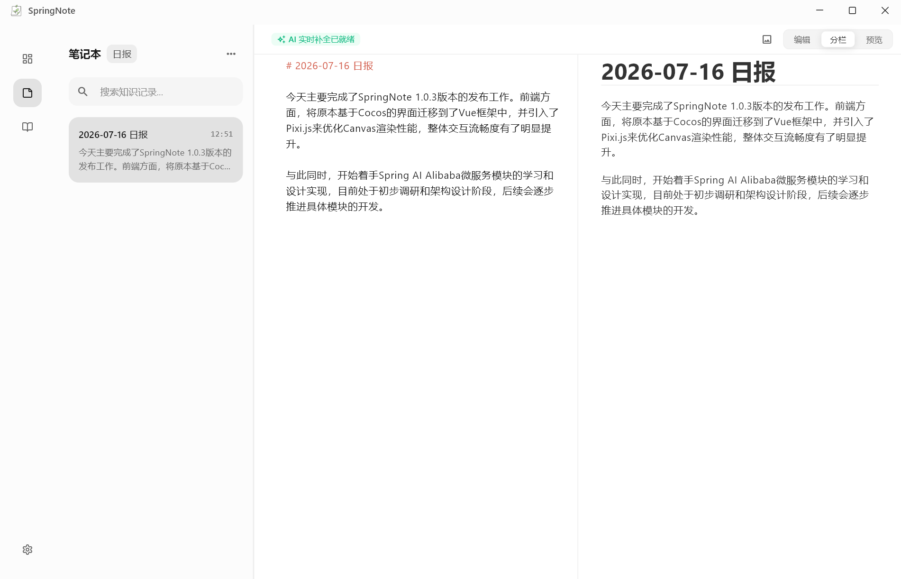
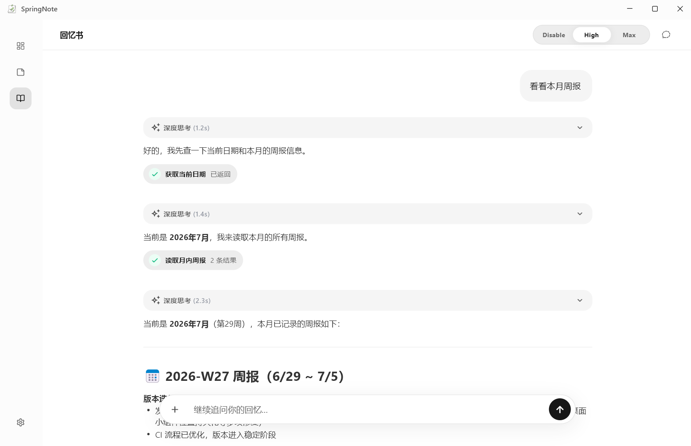
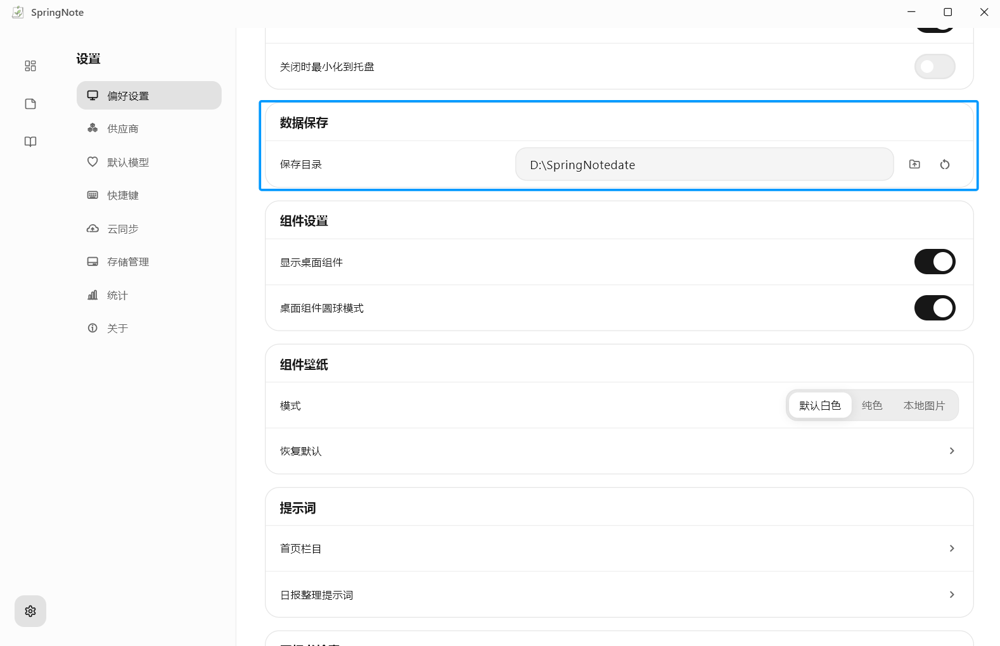
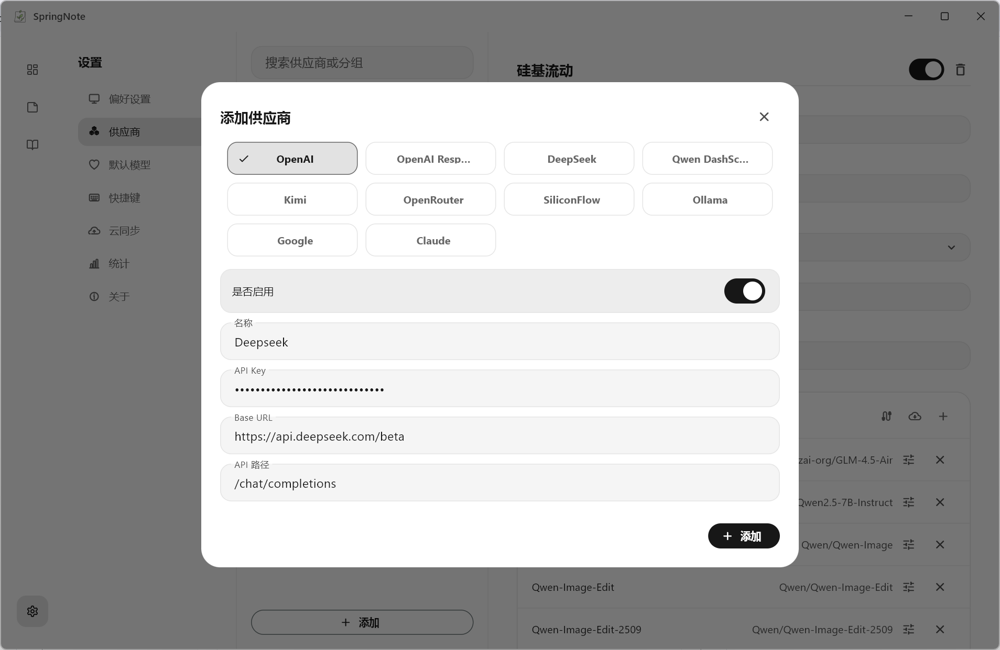
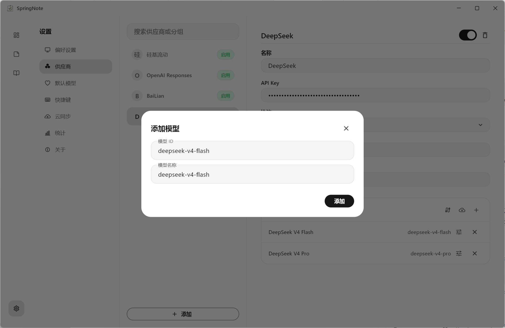
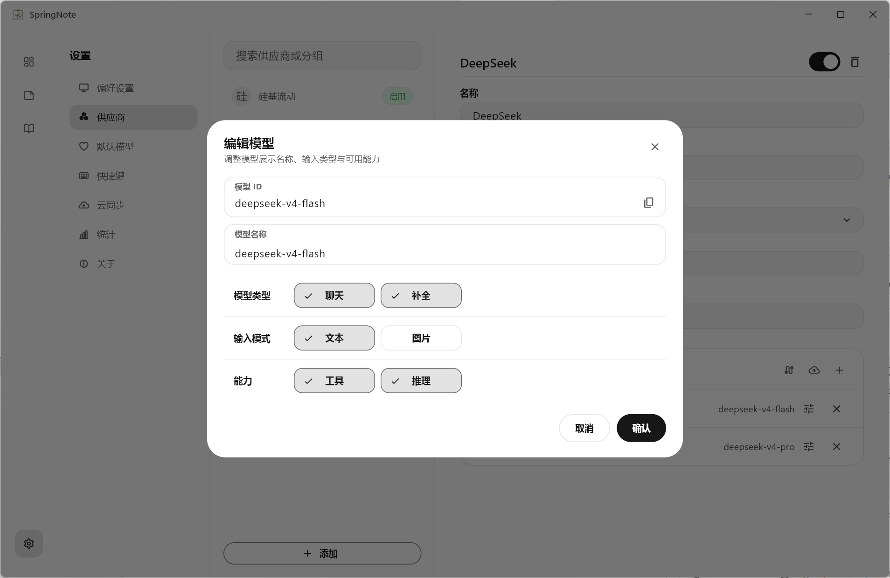
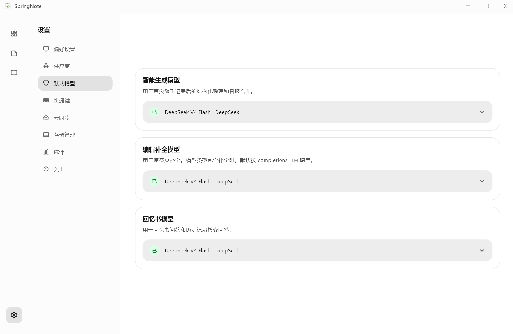

<!-- We've seen that note-taking tools usually just store text.
But SpringNote treats notes as something that grows over time.
Instead of static records, we model a living system:
  .     *   .       .        o        .       *     .   .
    .   .      |     .    .        .     .     *   .     .
       --o--           SpringNote           .      |   .
    *    |      .   capture → organize → reflect → grow
 .    .     .     .        .        .     .   --*--   .
      .        *      .        .     .        |     .  .
(ASCII art depicting scattered thoughts converging into SpringNote) -->

<h1 align="center">
  
  SpringNote
</h1>

## 为什么选择SpringNote

市面上的便签软件大多只能帮你保存内容，却很难帮你利用这些内容。SpringNote 因此而生。它不仅能够记录，更能够帮助你整理、沉淀和回顾。通过 AI 自动生成日报、周报和月报，并结合回忆书功能，让过去的记录变成随时可检索、可对话的个人知识资产。

## 核心功能

- **首页工作台**：牛马等级、收益、活跃热力图、快速输入框和今日摘要卡片。

  

- **AI 智能生成**：在首页快速输入想法，由 AI 自动整理为结构化内容。

- **便签编辑**：支持日报、周报、月报等记录类型，提供 Markdown 编辑、预览、代码块高亮和 AI 补全预测。

  

- **回忆书对话**：以对话方式检索和整理记忆内容，支持思考过程、工具调用展示与 Markdown 渲染。

  

- **自动报告生成**：启动时可按日期补齐缺失的周报/月报，基于已有日报或周报生成总结。

- **统计面板**：查看记录、活跃度、模型调用和时间范围内的数据概览。

  

- **牛马时钟**：支持自定义日薪和工作时长,自动计算时薪并作为组件展示在页面上。

  

- **桌面端极致体验**：支持自定义 Windows 标题栏、托盘、开机自启动、全局快捷键、桌面状态组件和系统字体切换。

## 快速开始

### 下载安装

#### 通过 GitHub 下载

请前往 [Release 页](https://github.com/Radiant303/SpringNote/releases/latest) 下载SpringNote

### 第一步：确认数据位置

首次使用时先确认数据保存目录。日报、周报、月报、图片和相关配置都会围绕这个目录保存；

### 第二步：配置 AI

以 **DeepSeek** 为例进行配置说明：

#### ① 添加供应商 BaseURL请填写 https://api.deepseek.com/beta

>
> 此处填写`beta`原因是Deepseek的[FIM接口要求](https://api-docs.deepseek.com/zh-cn/guides/fim_completion)
>
>其他的OpenAI兼容接口请依据实际情况填写
>

#### ② 手动添加模型 deepseek-v4-flash

>
>因为Deepseek的`beta`接口不支持模型列表查询，所以需要手动添加模型
>

#### ③ 编辑模型

>
>请手动勾选补全类型
>

#### ④ 选择默认模型

>
>如果你的模型不支持补全类型，则在编辑补全模型列表中不会出现该模型
>

### 第三步：完成第一次记录

### 第四步：在笔记本中查看和编辑

笔记本搜索只搜索当前选择的日报、周报或月报类型。搜索至少输入两个字符，点击结果后可以打开对应的完整正文。

### 第五步：使用回忆书

进入“回忆书”后，可以直接询问已经保存的工作记录。

### 第六步：使用牛马时钟

组件用于查看当前计时、当天工作时长和收益，并在主窗口之外控制计时。

- 左键单击组件：开始或暂停计时；
- 右键单击组件：打开主窗口并进入首页；
- 左键拖动组件：移动窗口位置；

### 继续探索

完成基本记录后，可以在设置中继续配置。更多使用说明请查看 [文档](https://radiant303.github.io/SpringNote/)

## 🌍 社区

无论你是在使用过程中遇到问题，还是有新的想法与建议，都欢迎与我们交流。

我们会认真聆听每一条反馈，持续优化 SpringNote，让它变得更好。

**加入 [SpringNote 官方交流群](https://qm.qq.com/q/c6QiowtYSA)，一起交流使用体验、分享想法。**

>QQ群号：**463423961**

>[!TIP]
>反馈问题时，请同时提供：
>- 当前版本号
>- 操作步骤
>- 是否能够稳定复现
>- 相关截图或错误信息
>
>这些信息可以帮助快速定位问题。

## ❤️ Special Thanks

特别感谢所有 Contributors和社区成员对 SpringNote 的支持 ❤️

## ⭐ Star History

> [!TIP]
> 如果本项目对您的生活 / 工作产生了帮助，或者您关注本项目的未来发展，请给项目 Star，这是我们维护这个开源项目的动力 <3

  

